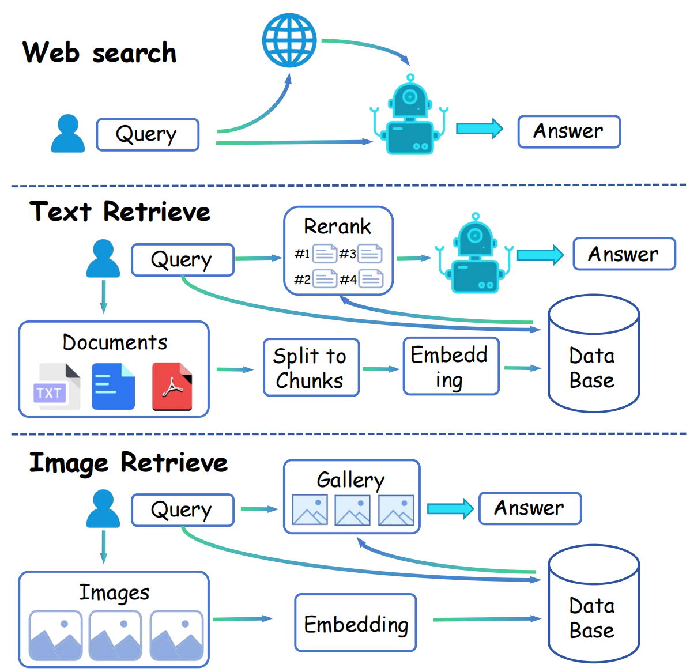

<p align="center">
  <h1 align="center"></h1>
  <h1 align="center">SODA: Search, Organize, Discovery Anything</h1>
</p>
<!-- <h2 align="center">Submitted to arXiv</h2>
  📖<a href="https://arxiv.org/pdf/2403.13805.pdf">Paper</a> |🏠<a href="https://liuziyu77.github.io/RAR/">Homepage</a></h3>
<div align="center"></div> -->
<p align="center">
<!--   <a href="">
    
  </a> -->
<br>

<p align="center">
  <a href="./README.md">English</a> |
  <a href="./README_zh.md">简体中文</a>
</p>

🌟 Welcome to my GitHub project! If you like what you see, don't hesitate to hit that star button! More stars, faster updates, more fun! 

## 📣 Introduction
With the advent and extensive deployment of Large Language Models (LLMs), these sophisticated systems have showcased immense potential in a variety of application domains. Nevertheless, even highly advanced models such as GPT-4 are not without their limitations; they aren't omniscient and are susceptible to the so-called 'hallucination problem'.

Acknowledging these constraints, we have innovated **SODA (Search, Organize, Discover Anything) - a cutting-edge information integration Tool**, propelled by the power of large language models(LLMs). SODA leverages an LLM at its core for processing information, adeptly sourcing data from a multitude of channels in response to user queries. This enables it to provide nuanced and comprehensive answers. Through SODA, users gain access to a sophisticated web search mechanism that fetches pertinent information from the internet. This integrates seamlessly with the innate knowledge of the LLM and external sources, ensuring answers are not only accurate but also reliable. Furthermore, SODA empowers users to upload personal files, facilitating the creation of a private, secure, and robust local knowledge database. This feature allows LLMs to assimilate new information effortlessly, eliminating the need for pre-training or fine-tuning, and to utilize this knowledge effectively in response to queries.

Overall, SODA is envisioned as a **secure**, **dependable**, and **intelligently sourced** tool. It's strategically designed to enable users to proficiently handle and interpret information gleaned from expansive models, the web, and your own database.

## 🔭 Architecture
SODA's architecture is show below:
<div align="center">

</div>

We support **web search**, **text retrieval(local database)** and **image retrieval(local database)** now. 
In text retrieval, we have implemented a **two-stage** retrieval process, consisting of initial database retrieval and subsequent reranking.

## 📢 News
- 🚀 [04/18/2024] We have open-sourced the first version of SODA, and more updates will be coming soon!!! 

## 💡 Highlights
- 🔥 **New technology framework.** We have developed an LLM-driven information integration tool, which provides a technical framework for retrieval argumented generation(RAG) and tool use directions for AI Agents.
- 🔥 **Good compatibility.** SODA is capable of easily swapping components, utilizing various search engines, vector databases or LLMs, and exhibits good compatibility.
- 🔥 **Reliable&traceable.** SODA effectively addresses partial hallucination issues of LLM, providing reliable and accurate answers with traceable information sources.
- 🔥 **Data privacy.** SODA supports local databases, allowing the model to acquire new knowledge without pretraining or finetuning, while effectively protecting user data privacy.

## 🛠️ Usage

### Contents
- [Install](#Install)
- [Web Search Pipeline with Various APIs](#Web-Search-Pipeline-with-Various-APIs)
- [Retrieve-Pipeline-Based-on-Local-Database](#Retrieve-Pipeline-Based-on-Local-Database)
- [LLMs](#LLMs)

### Install
To run SODA locally, clone the repository and set up the environment.
```bash
mkdir SODA
cd SODA
git clone https://github.com/Liuziyu77/Soda.git
pip install requirements.txt
```
To experiment with individual functions of SODA, navigate through various directories to execute `.ipynb` files. To run Gradio locally, please follow these instructions.
```bash
cd web_ui
python web_ui.py
```
Please note that you need to **modify the base_directory** path in `web_ui.py`. Intermediate files generated (such as databases built from local files) will be temporarily stored there. These files will be periodically cleaned up. If needed, please adjust the code accordingly.

To enable web search and utilize OpenAI's API, please enter the corresponding API keys in the `./web_search/utils.py` and `./mllm/soda_mllm.py` files.

### 🌐 Web Search Pipeline with Various APIs
The code related to web search is stored in the `web_search` folder. This folder contains a collection of code that utilizes various search engine APIs to retrieve relevant information based on user input. This process demonstrates an efficient integration of multiple search tools to optimize the relevance and accuracy of search results.

#### Using API
We have suported APIs of Google, Bing and Serper. You can run `./web_search/Google_API.ipynb`, `./web_search/Serper_API.ipynb` and `./web_search/Bing_API.ipynb` to test the usage of these search engines. But first of all, an API is necessary. Here are the links to get various search engine APIs.

* You can get Google APIs: [Google API](https://cloud.google.com/apis/docs/overview)
* You can get Bing APIs: [Bing API](https://serper.dev/)
* You can get Serper APIs: [Serper API](https://www.microsoft.com/en-us/bing/apis/bing-web-search-api)

Additionally, we will offer comprehensive search capabilities beyond **text**, including support for both **image and video searches** soon!

Here is the [Web Search Example](figures/web_search.mp4).
<details><summary>Web Search Example</summary> 
  


https://github.com/Liuziyu77/Soda_Dev/assets/137670115/7bc73223-eaa9-44f5-a379-8bf204d4380c


</details>

### 🔎 Retrieve Pipeline Based on Local Database
The code related to RAG on local database is stored in the `RAG` folder. This folder is the implement of building your own local database and retrieve information from it. It includes `text-text` retrieve, `image-image` retrieve and `image-image&text pair` retrieve. You can test the retrieval functionalities by running different `.ipynb` files, we provide three scripts as examples.

#### 1. Text-text retrieve
User can run the `./RAG/text_rag.ipynb` to build a text database and retrieve information from it. The only thing you need to do is just providing a text file path. We  support TXT, DOCX, PDF format now. 

We use **Sentense transfomer** as the text encoder. More encoder will be supported soon!

Here is the [Text Retrieve Example](figures/text_retrieve.mp4).
<details><summary>Text Retrieve Example</summary> 
  


https://github.com/Liuziyu77/Soda_Dev/assets/137670115/7a2042b9-7c03-44f4-9e36-abb7f244da19


</details>

#### 2. Image-Image retrieve
User can run the `./RAG/image_rag.ipynb` to build a image database and retrieve information from it. The only thing you need to do is just providing a folder path.

We use **CLIP-B/32** as the image encoder. More visual encoder will be supported soon!

Here is the [Image Retrieve Example](figures/image_retrieve.mp4).
<details><summary>Image Retrieve Example</summary> 
  


https://github.com/Liuziyu77/Soda_Dev/assets/137670115/761e489c-d572-4070-bb29-bb31d891f661


</details>

#### 3. Image-Image&Text retrieve
User can run the `./RAG/multimodal_rag.ipynb` to build a multimodal database and retrieve information from it. Here, you need to provide a `.tsv` file which include your data's `ID`, `PATH`, `INFO`. An example TSV file is `./RAG/artwork_data.tsv`.

### 🐑 LLMs
We use the InternLM-Xcomposer2(a vision-language large model (VLLM) based on InternLM2-7B) or GPT-4 to process the information from web and database, and feedback to users. We will soon support more LLMs as the information processing core for SODA.

### ✒️ Citation
```
@misc{2024SODA,
    title={SODA: Search, Organize, Discovery Anything},
    author={SODA Team},
    howpublished = {\url{https://github.com/Liuziyu77/Soda}},
    year={2024}
}
```

## 📜 License
  **Usage and License Notices**: The data and code are intended and licensed for research use only.
