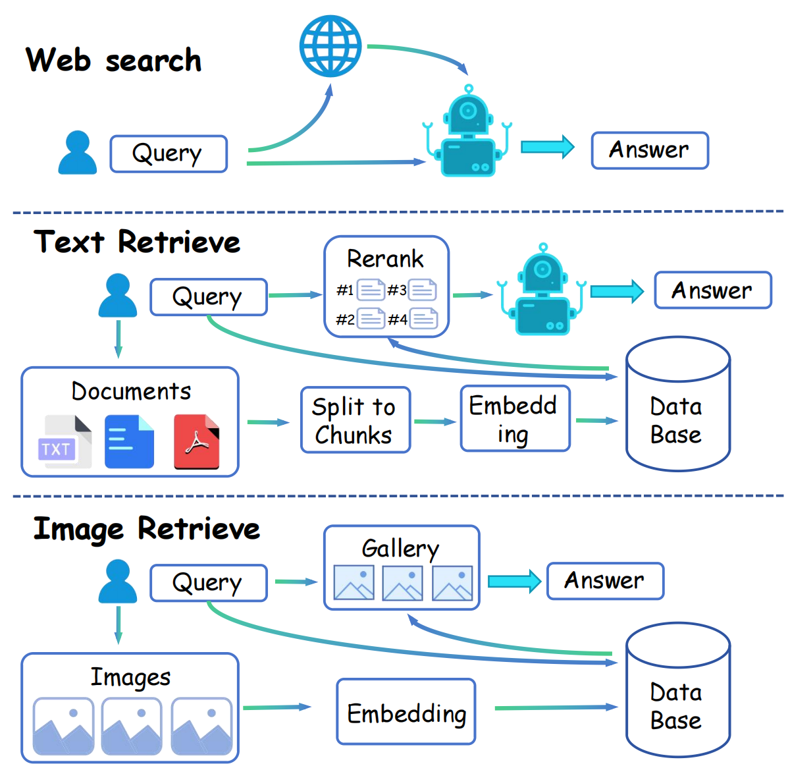

<p align="center">
  <h1 align="center"></h1>
  <h1 align="center">SODA: Search, Organize, Discovery Anything</h1>
</p>
<!-- <h2 align="center">Submitted to arXiv</h2>
  📖<a href="https://arxiv.org/pdf/2403.13805.pdf">Paper</a> |🏠<a href="https://liuziyu77.github.io/RAR/">Homepage</a></h3>
<div align="center"></div> -->
<p align="center">
<!--   <a href="">
    
  </a> -->
<br>

<p align="center">
  <a href="./README.md">English</a> |
  <a href="./README_zh.md">简体中文</a>
</p>

🌟 欢迎来到我的GitHub项目！如果这个项目让你心动，不妨赏个星星吧！点赞越多，更新越快，快乐越多！

## 📣 简介
随着大型语言模型（LLM）的出现和广泛部署，这些高级系统在多种应用领域展现了巨大的潜力。然而，即使是像GPT-4这样的先进模型也不是没有局限性；它们并非全知全能，且容易出现所谓的“幻觉问题”。

为了解决这些局限，我们创新了一款尖端的信息整合工具——**SODA(Search, Organize, Discover Anything)**。SODA以大型语言模型为核心，灵活地从众多渠道获取数据以响应用户查询，从而提供精细和全面的答案。通过SODA，用户可以利用一个高级的网络搜索机制，从互联网上提取相关信息。这使得LLM的内在知识和外部资源无缝整合，确保提供的答案不仅准确而且可靠。此外，SODA还支持用户上传个人文件，便于创建一个私密、安全且强大的本地知识数据库。这一功能使得LLM能够轻松吸收新信息，无需预训练或微调，有效地利用这些知识来响应用户输入。

总体而言，SODA被设计为一个安全、可靠、且智能信息采集和处理的工具。它的设计使用户能够处理和解释从大语言模型、网络和您自己的数据库中获得的信息。

## 🔭 SODA架构
SODA的架构如下所示：
<div align="center">

</div>
我们现在支持 **网络检索**, **文本检索(本地数据库)** and **图像检索(本地数据库)**。 
在文本检索阶段，我们实现了**两阶段**检索过程，第一阶段从数据库中检索信息，第二阶段对检索到的文本进行重新排序。

## 📢 New
- 🚀 [04/18/2024] 我们开源了第一版的SODA，即将发布更多更新！！！ 

## 💡 Highlights
- 🔥 **全新的技术框架** 我们开发了一款由LLM（大型语言模型）驱动的信息整合工具，它提供了一个用于检索增强生成（RAG）的技术框架，并为AI Agent提供了使用工具的指导。
- 🔥 **良好的兼容性** SODA能够轻松切换组件，使用不同的搜索引擎、向量数据库或LLM，并展现出良好的兼容性。
- 🔥 **可靠&信息来源可追溯** SODA有效地解决了LLM的部分幻觉问题，提供了可追溯信息源的可靠且准确的答案。
- 🔥 **数据隐私** SODA支持本地数据库，允许模型在不进行预训练或微调的情况下获取新知识，同时有效保护用户数据隐私。
  
## 🛠️ 使用方法

### 目录
- [安装](#安装)
- [网络搜索](#网络搜索)
- [本地数据库检索](#本地数据库检索)
- [大语言模型](#大语言模型)

### 安装
要在本地运行SODA，首先按照以下的命令行将项目克隆到本地，并安装依赖的包。
```bash
mkdir SODA
cd SODA
git clone https://github.com/Liuziyu77/Soda.git
pip install requirements.txt
```
如果要体验SODA的全部功能，请运行我们基于gradio构建的webui程序，命令行如下所示。如果要体验SODA中单一功能的效果，可以进入SODA子文件夹中寻找`.ipynb`文件，并运行。
```bash
cd web_ui
python web_ui.py
```
请注意，您需要在 `web_ui.py` 文件中修改 `base_directory` 路径。此路径用于临时存储中间文件（例如从本地文件构建的数据库）。这些文件将自动定期进行清理。如有需要，请相应调整代码。

为启用网络搜索功能并使用 OpenAI 的API，请在 `./web_search/utils.py` 和 `./mllm/soda_mllm.py` 文件夹中输入相应的 API 密钥。

### 🌐 网络搜索
与网络搜索相关的代码存放在 `web_search` 文件夹中。该文件夹包含了一系列代码，这些代码利用各种搜索引擎的API来根据用户输入检索相关信息。这一过程展示了多种搜索工具的有效整合，优化了搜索结果的相关性和准确性。

#### 使用API
我们现在已经支持谷歌，必应和serper的API。你可以通过运行`./web_search/Google_API.ipynb`， `./web_search/Serper_API.ipynb` 和 `./web_search/Bing_API.ipynb` 去测试不同搜索引擎。但是，你首先需要获取对应的API。以下是获取API的网页连接。

* 你可以获取 Google APIs: [Google API](https://cloud.google.com/apis/docs/overview)
* 你可以获取 Bing APIs: [Bing API](https://serper.dev/)
* 你可以获取 Serper APIs: [Serper API](https://www.microsoft.com/en-us/bing/apis/bing-web-search-api)

以下是网络搜索功能的示例： [Web Search Example](figures/web_search.mp4).
<details><summary>Web Search Example</summary> 
  


https://github.com/Liuziyu77/Soda_Dev/assets/137670115/7bc73223-eaa9-44f5-a379-8bf204d4380c


</details>


### 🔎 本地数据库检索
与本地数据库上的检索增强生成（RAG）相关的代码存放在 `RAG` 文件夹中。这个文件夹实现了构建您自己的本地数据库并从中检索信息。它包括 `text-text` 检索、`image-image` 检索以及 `image-image&text pair` 检索。您可以通过运行不同的 `.ipynb` 文件来测试检索功能，我们提供了三个脚本作为示例。

#### 1. 文本到文本的检索
运行 `./RAG/text_rag.ipynb` 来构建本地文本数据库并从中检索信息，你所需要做的唯一一件事就是修改上传的文件的路径。 SODA现在支持 TXT, DOCX, PDF 等文件格式。

SODA使用 **Sentense transfomer** 作文文本编码器，不久将会支持更多的文本编码器!

以下是文本检索的示例： [Text Retrieve Example](figures/text_retrieve.mp4).
<details><summary>Text Retrieve Example</summary> 
  


https://github.com/Liuziyu77/Soda_Dev/assets/137670115/7a2042b9-7c03-44f4-9e36-abb7f244da19


</details>

#### 2. 图像到图像的检索
运行 `./RAG/image_rag.ipynb` 构建本地图像数据库并从中检索图像。 你所需要做的唯一一件事就是修改上传的文件夹的路径。

我们使用 **CLIP-B/32** 作为图像编码器。不久将会支持更多的图像编码器!

以下是图像检索的示例： [Image Retrieve Example](figures/image_retrieve.mp4).
<details><summary>Image Retrieve Example</summary> 
  


https://github.com/Liuziyu77/Soda_Dev/assets/137670115/761e489c-d572-4070-bb29-bb31d891f661


</details>

#### 3. 图像到图文对的检索
运行 `./RAG/multimodal_rag.ipynb` 构建多模态数据库并从中检索信息。 在这里，用户需要提供了一个 `.tsv` 文件，包括`ID`, `PATH`, `INFO`。一个示例的 TSV 文件是 `./RAG/artwork_data.tsv`。

### 🐑 大语言模型
我们使用 InternLM-Xcomposer2 （一个基于 InternLM2-7B 的视觉语言模型）或者 GPT-4 来处理来自网络或者本地数据库的信息，并反馈给使用者。其中 InternLM-Xcomposer2 在本地运行。不久我们将会支持更多类型的大语言模型作为 SODA 的信息处理大脑。

### ✒️ Citation
```
@misc{2024SODA,
    title={SODA: Search, Organize, Discovery Anything},
    author={SODA Team},
    howpublished = {\url{https://github.com/Liuziyu77/Soda}},
    year={2024}
}
```

## 📜 License
  **Usage and License Notices**: The data and code are intended and licensed for research use only.
